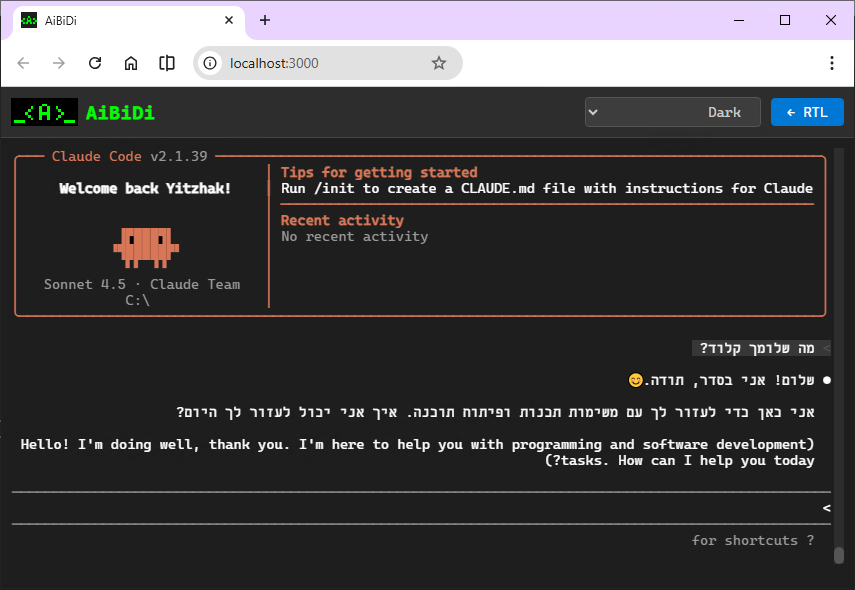

# AiBiDi

AiBiDi (or CliBiDi) is a browser-based terminal with native BiDi (Bidirectional Text) support for RTL (Right-to-Left) languages. Now you can interact with AI via CLI in your natural language: Hebrew, Arabic, Dhivehi, Kurdish, Pashto, Persian, Sindhi, Urdu, Uyghur, Yiddish.



## Features

- ✅ **BiDi & RTL Languages Support** - Hebrew, Arabic, Dhivehi, Kurdish, Pashto, Persian, Sindhi, Urdu, Uyghur, Yiddish
- ✅ **RTL/LTR Toggle** - Switch modes with F9 or button click
- ✅ **Multiple Themes** - Dark, Light, Dracula, Monokai, Solarized, Nord
- ✅ **File Drag & Drop** - Drag files to insert their path
- ✅ **Full Terminal Features** - Colors, bold, underline, all ANSI codes

## Installation

```bash
# Clone the repository
git clone https://github.com/your-username/aibidi.git
cd aibidi

# Install dependencies
npm install
```

## Usage

### Windows
```bash
# Double-click AiBiDi.bat
# Or run:
npm start
```

### Linux/Mac
```bash
# Make executable (first time only)
chmod +x AiBiDi.sh

# Run
./AiBiDi.sh
# Or:
npm start
```

The terminal will open automatically in your default browser at `http://localhost:8200` (or next available port).

## Keyboard Shortcuts

| Shortcut | Action |
|----------|--------|
| `F9` | Toggle RTL/LTR mode |
| `Ctrl+V` | Paste from clipboard |

## How It Works

```
Browser (xterm.js) ← WebSocket → Node.js Server ← PTY → Shell (bash/powershell)
```

AiBiDi uses the browser's native BiDi rendering to display RTL text correctly, solving the common problem of RTL text appearing incorrectly in traditional terminals.

## Acknowledgments

This project uses the following open source packages:

- [Express.js](https://expressjs.com/) - MIT License
- [ws](https://github.com/websockets/ws) - MIT License
- [node-pty](https://github.com/microsoft/node-pty) - MIT License
- [multer](https://github.com/expressjs/multer) - MIT License
- [portfinder](https://github.com/http-party/node-portfinder) - MIT License
- [@xterm/xterm](https://github.com/xtermjs/xterm.js) - MIT License
- [@xterm/addon-fit](https://github.com/xtermjs/xterm.js) - MIT License
- [Cascadia Mono](https://github.com/microsoft/cascadia-code) - SIL Open Font License 1.1

## Author

**Yitzhak Schlissel**

## License

MIT License - see [LICENSE](LICENSE) file for details.

Font: Cascadia Mono is licensed under SIL Open Font License 1.1 - see [fonts/LICENSE](src/public/fonts/LICENSE).
